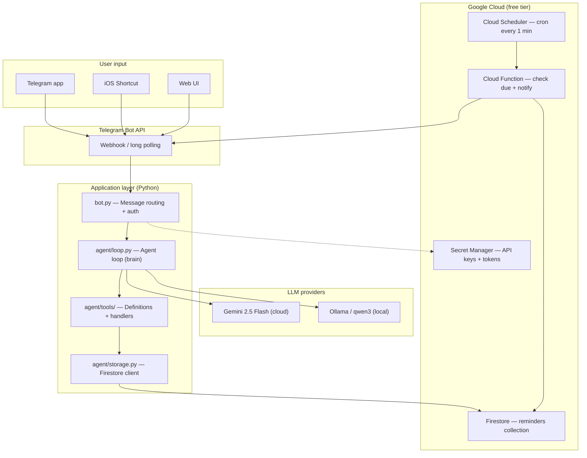
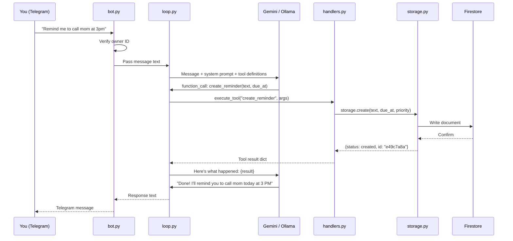

# Agentic Reminder Assistant

A personal reminder system built as an agentic AI application. The LLM doesn't just chat — it reasons about your intent, picks the right tool, executes it against a real database, and reports back in natural language.

Built with Python, Gemini/Ollama, Firestore, and Telegram.

## System architecture



## Data flow — what happens when you send a message



## How the agent loop works

This is the core pattern behind every agentic system:

```
1. User sends a message
2. Message + system prompt + tool definitions → LLM
3. LLM returns either:
   a. Text response (no action needed) → return to user
   b. Tool call (action needed) → go to step 4
4. Execute the tool with the LLM's parameters
5. Tool result → LLM (so it can summarize what happened)
6. LLM generates a human-friendly response → return to user
```

The LLM decides which tool to call based on the tool descriptions you define. Better descriptions = more reliable tool selection.

## Project structure

```
agentic-reminder-app/
├── agent/
│   ├── __init__.py
│   ├── loop.py              # Agent loop — Gemini + Ollama backends
│   ├── storage.py           # Firestore CRUD operations
│   └── tools/
│       ├── __init__.py
│       ├── definitions.py   # Tool schemas (JSON) for the LLM
│       └── handlers.py      # Tool implementations + registry
├── bot.py                   # Telegram bot entry point
├── .env.example             # Config template (no secrets)
├── .gitignore
├── pyproject.toml
└── uv.lock
```

### Layer separation

The codebase follows a strict three-layer architecture:

| Layer | Files | Responsibility |
|-------|-------|----------------|
| Interface | `bot.py` | Receives messages from Telegram, sends responses. Knows nothing about the LLM. |
| Brain | `agent/loop.py` | Sends messages to the LLM, handles tool calls, returns text. Knows nothing about Telegram. |
| Tools | `agent/tools/`, `agent/storage.py` | Executes business logic, reads/writes Firestore. Knows nothing about the LLM or Telegram. |

Each layer only talks to its neighbor. Swapping Telegram for Slack, or Gemini for Claude, means changing one file — not the whole codebase.

## Tools

The agent has 6 tools available:

| Tool | What it does | Required params |
|------|-------------|-----------------|
| `create_reminder` | Create a new reminder | `text` |
| `list_reminders` | Show reminders by status | none |
| `complete_reminder` | Mark as done | `reminder_id` |
| `snooze_reminder` | Postpone to later | `reminder_id` |
| `delete_reminder` | Permanently remove | `reminder_id` |
| `update_reminder` | Change priority or due date | `reminder_id` |

The LLM chains tools when needed — for example, "mark the groceries one as done" triggers `list_reminders` first to find the ID, then `complete_reminder` with that ID.

## Setup

### Prerequisites

- Python 3.12+
- [uv](https://docs.astral.sh/uv/) (package manager)
- A Google Cloud project with Firestore enabled (Native mode)
- `gcloud` CLI installed and authenticated
- A Telegram bot token (from [@BotFather](https://t.me/botfather))

### Install

```bash
git clone https://github.com/your-username/agentic-reminder-app.git
cd agentic-reminder-app
cp .env.example .env   # Fill in your values
uv sync
```

### Configure `.env`

```env
TELEGRAM_BOT_TOKEN=your-bot-token
TELEGRAM_OWNER_ID=your-numeric-user-id
LLM_BACKEND=ollama          # or "gemini"
OLLAMA_MODEL=qwen3:4b        # only needed if LLM_BACKEND=ollama
GOOGLE_API_KEY=your-key      # only needed if LLM_BACKEND=gemini
GCP_PROJECT_ID=your-project-id
```

### Authenticate with GCP

```bash
gcloud auth application-default login
gcloud auth application-default set-quota-project YOUR_PROJECT_ID
```

### Run

**Terminal mode (no Telegram):**
```bash
uv run python -m agent.loop
```

**Telegram bot:**
```bash
uv run python bot.py
```

### Using a local LLM (Ollama)

```bash
# Install Ollama from https://ollama.com
ollama pull qwen3:4b
# Set LLM_BACKEND=ollama in .env, then run
```

## Security

- Bot only responds to messages from `TELEGRAM_OWNER_ID` — all other users get rejected
- API keys and tokens live in `.env`, never committed to git
- Firestore access uses Application Default Credentials (no key files in the repo)
- Tool execution is registry-based — the LLM can only call functions that exist in `TOOL_REGISTRY`

## Tech stack

| Component | Technology | Cost |
|-----------|-----------|------|
| LLM (cloud) | Gemini 2.5 Flash | Free tier: 250 req/day |
| LLM (local) | Ollama + qwen3 | Free forever |
| Database | Google Firestore | Free tier: 50k reads/day |
| Chat interface | Telegram Bot API | Free |
| Language | Python 3.12 | - |
| Package manager | uv | - |


## License

MIT
